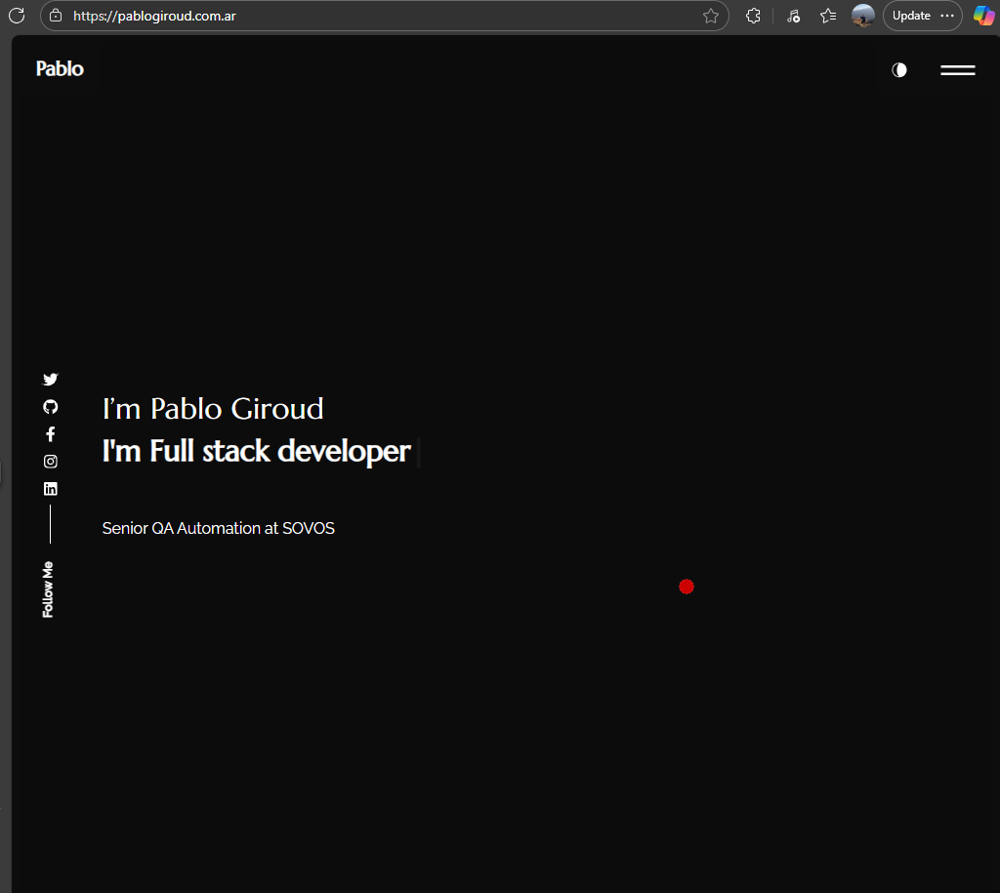

# Portafolio Personal con React

Este es un portafolio personal dinámico y moderno, creado con React para mostrar mis proyectos, habilidades y experiencia profesional.



## ✨ Características

*   **Single Page Application (SPA):** Construido con React y React Router para una navegación fluida sin recargar la página.
*   **Diseño Responsivo:** Adaptable a diferentes tamaños de pantalla, desde móviles hasta escritorios.
*   **Secciones Claras:** Incluye secciones de Inicio, Sobre Mí, Portafolio y Contacto.
*   **Portafolio Dinámico:** Las vistas previas de los proyectos se generan automáticamente a partir de los enlaces, utilizando el servicio thum.io.
*   **Cambio de Tema:** Permite cambiar entre un tema claro y uno oscuro.
*   **Formulario de Contacto Funcional:** Integrado con EmailJS y Google reCAPTCHA para recibir mensajes de forma segura.

## 🛠️ Tecnologías Utilizadas

*   **Frontend:** React, HTML5, CSS3
*   **Enrutamiento:** React Router DOM
*   **Componentes UI:** React Bootstrap
*   **Iconos:** React Icons
*   **Envío de Formularios:** EmailJS
*   **Seguridad:** Google reCAPTCHA
*   **Despliegue:** Netlify

## 🚀 Cómo Empezar

Sigue estos pasos para configurar y ejecutar el proyecto en tu máquina local.

### Prerrequisitos

*   Node.js (v14 o superior)
*   npm o yarn

### Instalación

1.  Clona el repositorio:
    ```bash
    git clone https://github.com/pablogiroud/portfolio.git
    cd portfolio
    ```

2.  Instala las dependencias:
    ```bash
    npm install
    # o
    yarn install
    ```

3.  **Configurar variables de entorno:**
    Crea un archivo `.env` en la raíz del proyecto y añade las siguientes variables. Puedes usar el archivo `.env.example` como plantilla.

    ```
    REACT_APP_YOUR_SERVICE_ID=tu_service_id_de_emailjs
    REACT_APP_YOUR_TEMPLATE_ID=tu_template_id_de_emailjs
    REACT_APP_PUBLIC_KEY=tu_public_key_de_emailjs
    REACT_APP_CAPTCHA_SITE_KEY=tu_site_key_de_google_recaptcha
    ```
    *   Obtén tus credenciales de EmailJS.
    *   Obtén tu Site Key de Google reCAPTCHA.

### Ejecución

*   **Para desarrollo:**
    ```bash
    npm start
    ```
    Abre http://localhost:3000 en tu navegador.

*   **Para producción:**
    ```bash
    npm run build
    ```
    Esto creará una carpeta `build` con los archivos estáticos listos para desplegar.

## 🔧 Personalización

La mayor parte del contenido del sitio (textos, enlaces a redes sociales, proyectos del portafolio, etc.) se puede modificar fácilmente editando el archivo:
`src/content_option.js`

## 📄 Licencia

Este proyecto está bajo la Licencia MIT. Ver el archivo `LICENSE` para más detalles.

## 📬 Contacto

Pablo Giroud - pablogiroud@gmail.com

Enlace del Proyecto: https://github.com/pablogiroud/portfolio

